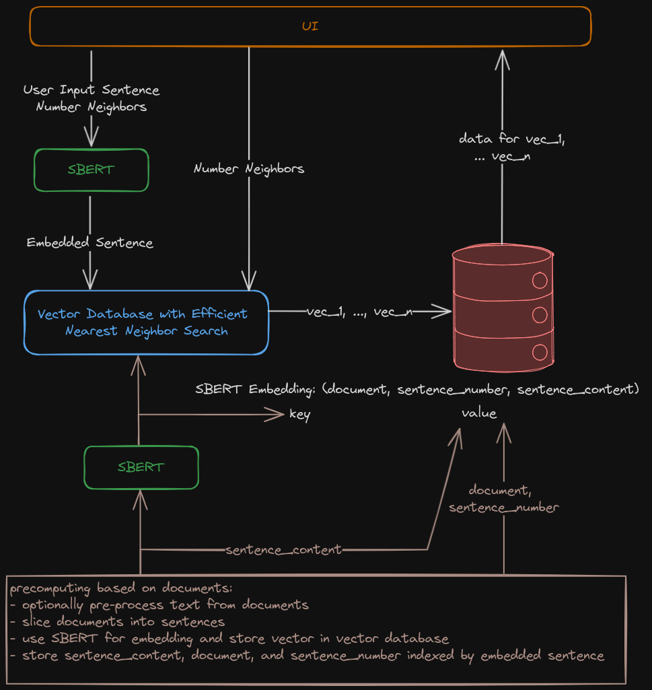

# Documentation

## User Interface Preliminary Specification
The final user interface is envisioned to have a textbox where the user enters a sentence.
Below that the user can select the number of results he wants to see.

When the user presses the ´FIND RESULTS´ the interface presentes a list of sentences which are semantically the closest to the input together with the document and information where in the document (SENTENCE NUMBER) the sentence was found.

## Preliminary Architecture
The Architecture will have at its core a model to evaluate semantic similarity of sentences.
A likely well suited candidate is described in the [Sentence-BERT paper](https://arxiv.org/abs/1908.10084).

The naive solution is to just compare every sentence from the documents with the one given by the user.
This does not scale well hence we use the [faiss library](https://github.com/facebookresearch/faiss) to precompute a vector-database for the sentences in the SBERT embeddings which quickly allows the retrieval of nearest neighbours of a given vector.

In a second as well precomputed content-database we store content and metadata for each sentence indexed by the sentences' SBERT embedding.

One important edge case to consider is what to do when the exact same sentence (relatively likely) occurs in multiple documents or in the same document multiple times.
A less likely edge-case is that two non-identical sentences have the exact same embedding.
For our first proof-of-concept we do not define a behaviour for these cases.

